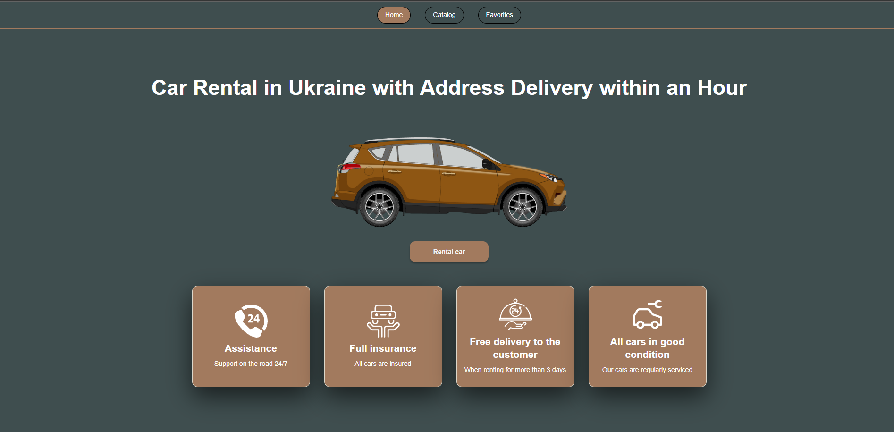
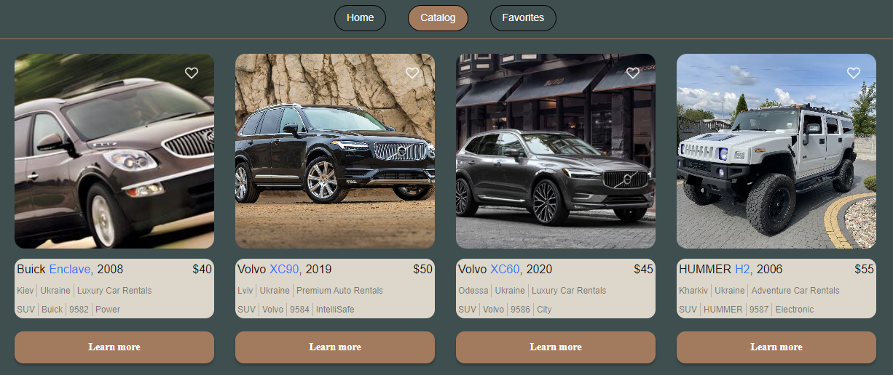
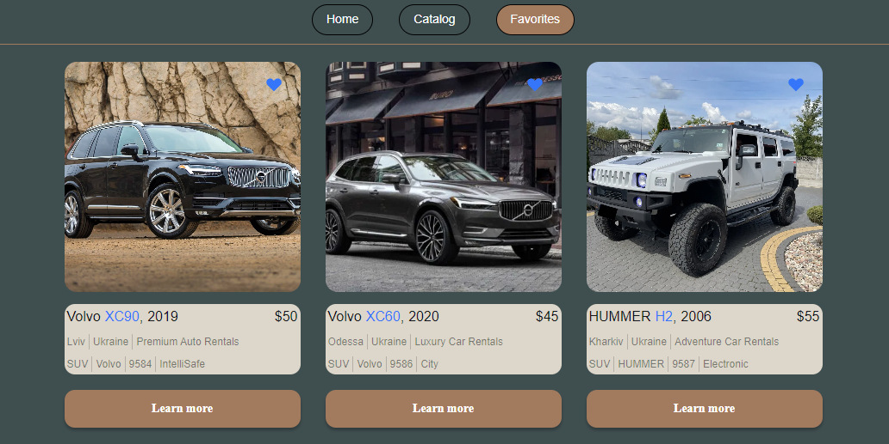
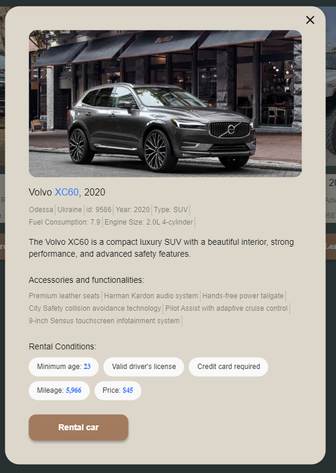

Car Rental Hub
Welcome to Car Rental Hub, your gateway to a seamless and enjoyable car rental experience. Whether you're planning a quick weekend getaway or embarking on an epic road trip, we've got all your car rental needs covered. Below, we'll walk you through the essential features of our platform:

App: Our platform boasts a user-friendly interface with three primary sections - Home, Catalog, and Favorites.

Home: The Home section provides an insightful overview of our car rental services, highlighting what sets us apart and why you should opt for our platform for your car rental needs.

Catalog: Explore a diverse selection of available vehicles in our Vehicle Inventory section. You can effortlessly browse through the catalog and load additional vehicle listings with the "Load More" button. Once you've reached the end of the catalog, the button disappears, signifying that you've seen all the available options.

Favorites: Each vehicle listing in the catalog features a heart-shaped icon, enabling you to add your preferred cars to your Favorites collection. This feature simplifies keeping track of the vehicles that catch your eye. The Favorites section stores all the vehicles you've added, allowing for easy access and convenient comparisons.

Effortless Filtering: Both the Vehicle Inventory and Favorites sections offer filtering options to streamline your search. You can filter vehicles by Brand, Hourly Rental Price, and Mileage in kilometers.

Error Notifications: To ensure a smooth user experience, we've incorporated error notifications in the form of toast messages. These messages promptly inform you of any input or search errors, guaranteeing hassle-free browsing. If you wish to start anew, there's a reset button available to clear your filters and begin a fresh search.

Car Rental Hub simplifies the car rental process with its user-friendly platform and a comprehensive set of features. Whether you're in search of a specific car brand, competitive pricing, or low-mileage options, our platform has you covered. Embark on your next adventure today with Car Rental Hub!

